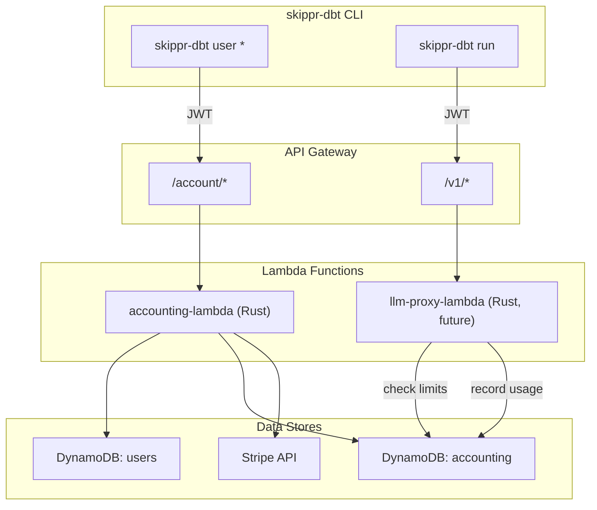

# Accounting Service Lambda

## Architecture




## Project structure (new repo: `skippr-accounting`)

```
skippr-accounting/
  cdk/                        # CDK infra (TypeScript)
    bin/app.ts
    lib/accounting-stack.ts
    package.json
    tsconfig.json
    cdk.json
  lambda/                     # Rust Lambda handler
    Cargo.toml
    src/
      main.rs                 # Lambda entrypoint + router
      routes/
        mod.rs
        account.rs            # GET /account
        checkout.rs           # POST /billing/checkout
        webhook.rs            # POST /billing/webhook
        usage.rs              # POST /usage/record  (called by LLM proxy)
        usage_check.rs        # GET /usage/check    (called by LLM proxy)
      db.rs                   # DynamoDB operations
      stripe_client.rs        # Stripe API client
      jwt.rs                  # JWT validation (shared logic with auth service)
      types.rs                # Request/response types, DynamoDB item shapes
      error.rs                # Error types + API error responses
  Makefile                    # cargo-lambda build + cdk deploy
  README.md
```

## DynamoDB tables

### `skippr-accounting` table (single-table design)

All accounting state in one table. Partition key + sort key design for flexible access patterns.

```
PK              SK                          Attributes
-----------------------------------------------------------------
USER#{user_id}  PROFILE                     email, stripe_customer_id,
                                            billing_status (free|active|past_due|cancelled),
                                            plan (free|pro),
                                            created_at

USER#{user_id}  METER#llm_tokens#2026-03    used (number), limit (number),
                                            unit ("tokens"), updated_at

USER#{user_id}  METER#pipeline_runs#2026-03 used (number), limit (number),
                                            unit ("runs"), updated_at

USER#{user_id}  METER#storage_bytes#2026-03 used (number), limit (number),
                                            unit ("bytes"), updated_at

USER#{user_id}  STRIPE_SUB                  stripe_subscription_id,
                                            stripe_price_id, current_period_start,
                                            current_period_end, status
```

Key design decisions:

- **Single table** avoids cross-table queries; all user data fetched with `Query(PK = USER#{user_id})`
- **METER#** prefix on SK enables: (a) adding new meter types with zero schema changes, (b) querying all meters for a user with `begins_with(SK, "METER#")`, (c) atomic `ADD` on `used` for concurrent increment
- **Period in SK** (`2026-03`) means historical usage is preserved automatically; no rollover job needed to zero counters — just start writing to the new period key
- GSI on `stripe_customer_id` for webhook lookups (Stripe sends customer ID, not your user ID)

### GSI: `stripe-customer-index`

```
GSI PK: stripe_customer_id    GSI SK: PK (the USER#{user_id})
```

Used exclusively by the Stripe webhook handler to resolve `customer` -> `user_id`.

## API endpoints

All endpoints behind API Gateway, JWT-authenticated (except the Stripe webhook which uses Stripe signature verification).

### `GET /account`

Returns user profile, current-period usage for all meters, billing status, and Stripe portal links.

**Request:** `Authorization: Bearer {jwt}`

**Response:**

```json
{
  "user_id": "usr_abc123",
  "email": "paul@skippr.dev",
  "plan": "pro",
  "billing_status": "active",
  "usage": {
    "period": "2026-03",
    "meters": [
      { "meter": "llm_tokens", "used": 45012, "limit": 100000, "unit": "tokens" }
    ]
  },
  "billing": {
    "manage_url": "https://billing.stripe.com/p/session/...",
    "invoices_url": "https://billing.stripe.com/p/session/..."
  }
}
```

Implementation:

1. Decode JWT, extract `user_id`
2. `Query(PK = USER#{user_id})` — returns profile + all meters + subscription in one call
3. Derive current period from UTC now (`2026-03`)
4. Filter meters to current period
5. Call `stripe::billing_portal::Session::create()` for manage + invoice URLs
6. Return assembled response

### `POST /billing/checkout`

Creates a Stripe Checkout Session for new subscribers.

**Request:** `Authorization: Bearer {jwt}`, body: `{ "plan": "pro" }`

**Response:** `{ "checkout_url": "https://checkout.stripe.com/..." }`

Implementation:

1. Decode JWT, extract `user_id` + `email`
2. Look up or create `stripe_customer_id` (idempotent via DynamoDB conditional write)
3. Call `stripe::checkout::Session::create()` with price ID for the plan, `customer`, `success_url`, `cancel_url`
4. Return the session URL

### `POST /billing/webhook`

Stripe webhook handler. Verifies signature, processes subscription lifecycle events.

**Request:** Stripe-signed payload (no JWT)

**Events handled:**


| Stripe event                    | Action                                                                       |
| ------------------------------- | ---------------------------------------------------------------------------- |
| `checkout.session.completed`    | Set `billing_status = active`, write STRIPE_SUB item, provision meter limits |
| `customer.subscription.updated` | Update plan/limits if changed                                                |
| `customer.subscription.deleted` | Set `billing_status = cancelled`, set meter limits to free tier              |
| `invoice.payment_succeeded`     | Set `billing_status = active` (clears past_due)                              |
| `invoice.payment_failed`        | Set `billing_status = past_due`                                              |


Implementation:

1. Verify Stripe webhook signature using `stripe-webhook-secret` from env/Secrets Manager
2. Parse event type and extract `customer` ID
3. Query GSI `stripe-customer-index` to resolve `user_id`
4. Apply state change to DynamoDB (profile + subscription items)
5. For `checkout.session.completed`: initialize meter limits based on plan (e.g., pro = 100k tokens/month)

### `POST /usage/record`

Called by the LLM proxy after each request completes. Records token usage.

**Request:** Internal service-to-service auth (shared secret or IAM role, not user JWT)

```json
{
  "user_id": "usr_abc123",
  "meter": "llm_tokens",
  "delta": 1523
}
```

**Response:** `{ "ok": true }`

Implementation:

1. Validate service auth
2. Derive current period from UTC now
3. `UpdateItem(PK = USER#{user_id}, SK = METER#llm_tokens#2026-03)` with `ADD used :delta`
4. If item doesn't exist, DynamoDB `ADD` creates it with `used = delta` (atomic, no race conditions)

### `GET /usage/check`

Called by the LLM proxy before proxying a request. Fast gate check.

**Request:** Internal service auth + `?user_id=usr_abc123&meter=llm_tokens`

**Response:**

```json
{
  "allowed": true,
  "used": 45012,
  "limit": 100000,
  "billing_status": "active"
}
```

Implementation:

1. Validate service auth
2. `GetItem(PK = USER#{user_id}, SK = PROFILE)` — check `billing_status`
3. `GetItem(PK = USER#{user_id}, SK = METER#llm_tokens#2026-03)` — check `used < limit`
4. Return `allowed = billing_status in (active, free) && used < limit`

This is called on every LLM request so it must be fast. Two `GetItem` calls to DynamoDB with consistent reads is ~5ms total.

## Lambda handler (Rust)

### Dependencies (`lambda/Cargo.toml`)

```toml
[package]
name = "skippr-accounting"
version = "0.1.0"
edition = "2021"

[dependencies]
lambda_http = "0.13"
lambda_runtime = "0.13"
aws-sdk-dynamodb = "1"
aws-config = "1"
serde = { version = "1", features = ["derive"] }
serde_json = "1"
jsonwebtoken = { version = "10", features = ["rust_crypto"] }
reqwest = { version = "0.12", default-features = false, features = ["rustls-tls", "json"] }
tokio = { version = "1", features = ["macros"] }
tracing = "0.1"
tracing-subscriber = { version = "0.3", features = ["env-filter", "json"] }
chrono = { version = "0.4", features = ["serde"] }
```

No Stripe Rust SDK (it's unmaintained). Use `reqwest` to call Stripe's REST API directly — it's a handful of endpoints with well-documented JSON payloads. Wrap in a thin `stripe_client.rs` module.

### Handler structure (`main.rs`)

```rust
use lambda_http::{run, service_fn, Request, Response, Body};

async fn handler(req: Request) -> Result<Response<Body>, lambda_http::Error> {
    let path = req.uri().path();
    let method = req.method().as_str();
    match (method, path) {
        ("GET",  "/account")          => routes::account::get(req).await,
        ("POST", "/billing/checkout") => routes::checkout::post(req).await,
        ("POST", "/billing/webhook")  => routes::webhook::post(req).await,
        ("POST", "/usage/record")     => routes::usage::record(req).await,
        ("GET",  "/usage/check")      => routes::usage_check::get(req).await,
        _ => Ok(Response::builder().status(404).body("not found".into())?),
    }
}

#[tokio::main]
async fn main() -> Result<(), lambda_http::Error> {
    tracing_subscriber::fmt().json().init();
    run(service_fn(handler)).await
}
```

### JWT validation (`jwt.rs`)

Reuse the same JWT secret/public key as the auth service. Decode and validate:

- `exp` (expiry)
- `sub` (user_id)
- `iss` (must be your auth service)

Key loaded from `JWT_PUBLIC_KEY` environment variable (set via CDK from Secrets Manager).

### DynamoDB client (`db.rs`)

Thin wrapper around `aws-sdk-dynamodb::Client`:

- `get_profile(user_id)` -> `Option<UserProfile>`
- `get_meter(user_id, meter, period)` -> `Option<MeterItem>`
- `get_all_meters(user_id, period)` -> `Vec<MeterItem>`
- `increment_meter(user_id, meter, period, delta)` -> `MeterItem`
- `put_profile(profile)` / `update_billing_status(user_id, status)`
- `put_subscription(user_id, sub)` / `get_by_stripe_customer(stripe_customer_id)` (GSI query)

Table name from `TABLE_NAME` env var.

## CDK stack (`cdk/lib/accounting-stack.ts`)

```
Resources:
  - DynamoDB table: skippr-accounting
    - PK: pk (S), SK: sk (S)
    - GSI: stripe-customer-index (pk: stripe_customer_id, sk: pk)
    - Billing: PAY_PER_REQUEST
    - Point-in-time recovery: enabled

  - Lambda function: skippr-accounting
    - Runtime: provided.al2023 (custom runtime, Rust binary)
    - Memory: 256 MB
    - Timeout: 30s
    - Environment:
      - TABLE_NAME (from DynamoDB table)
      - STRIPE_SECRET_KEY (from Secrets Manager)
      - STRIPE_WEBHOOK_SECRET (from Secrets Manager)
      - JWT_PUBLIC_KEY (from Secrets Manager)
      - STRIPE_PRO_PRICE_ID
      - PORTAL_RETURN_URL
    - IAM: dynamodb:Query, GetItem, PutItem, UpdateItem, DeleteItem on table + GSI

  - API Gateway (HTTP API):
    - Routes:
      GET  /account          -> Lambda
      POST /billing/checkout -> Lambda
      POST /billing/webhook  -> Lambda  (no auth)
      POST /usage/record     -> Lambda  (IAM auth for service-to-service)
      GET  /usage/check      -> Lambda  (IAM auth for service-to-service)
    - JWT authorizer on /account and /billing/checkout
    - No authorizer on /billing/webhook (Stripe signature verified in handler)
    - IAM authorizer on /usage/* (LLM proxy Lambda calls via IAM role)

  - Secrets Manager entries (manual creation, referenced by CDK):
    - skippr/stripe-secret-key
    - skippr/stripe-webhook-secret
    - skippr/jwt-public-key
```

## Build and deploy

**Makefile:**

```make
build:
    cargo lambda build --release --output-format zip

deploy:
    cd cdk && npx cdk deploy --all

synth:
    cd cdk && npx cdk synth
```

Uses `cargo-lambda` for cross-compilation to Amazon Linux 2023 (x86_64 or arm64). The CDK stack references the built zip artifact from `target/lambda/skippr-accounting/bootstrap.zip`.

## skippr-dbt CLI changes (separate PR, in the react repo)

Add `skippr-dbt user account` command that calls `GET /account` and renders the response:

```
$ skippr-dbt user account

  Account:    paul@skippr.dev
  Plan:       Pro
  Status:     Active

  Usage (March 2026):
    LLM tokens    45,012 / 100,000

  Billing:
    Manage plan   https://billing.stripe.com/p/session/xxx
    Invoices      https://billing.stripe.com/p/session/yyy
```

The accounting service base URL is either hardcoded or resolved from the auth service's `/credentials` response.

## Stripe setup (manual, one-time)

1. Create product "skippr-dbt Pro" in Stripe dashboard
2. Create recurring price (e.g., $49/month) — note the `price_id`
3. Set `STRIPE_PRO_PRICE_ID` in CDK env
4. Create webhook endpoint in Stripe dashboard pointing to `POST /billing/webhook`
5. Select events: `checkout.session.completed`, `customer.subscription.updated`, `customer.subscription.deleted`, `invoice.payment_succeeded`, `invoice.payment_failed`
6. Note the webhook signing secret, store in Secrets Manager

## Free tier

Users start with `billing_status = free` and default meter limits (e.g., 10k tokens/month). Profile is created by the auth service on signup (or lazily by the accounting service on first `GET /account`). No Stripe subscription required for free tier — just default limits written to the meter items.

## What this plan does NOT cover (separate work)

- LLM proxy Lambda (separate service, calls `/usage/check` and `/usage/record`)
- STS credential exchange (lives in auth service)
- `skippr-dbt user signup/login/logout` (CLI auth flow, calls existing auth service)
- Period rollover automation (not needed — period is encoded in the SK, new period = new item with default limits)

