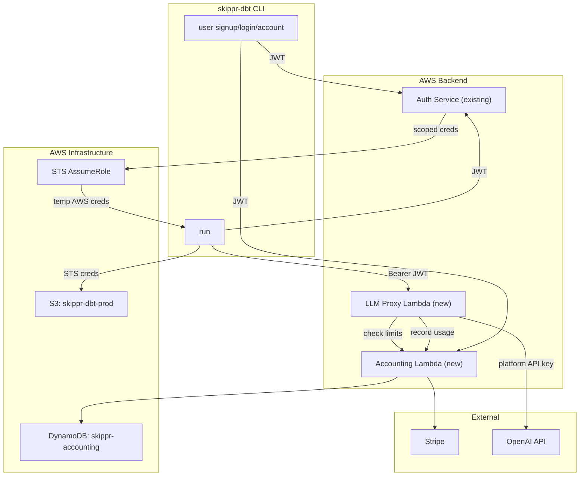

# skippr-dbt Productisation Plan

## Product model

CLI-first SaaS (Cursor/Vercel model). No backend UI except Stripe hosted pages. User signs up, authenticates, and manages billing entirely via the CLI + Stripe links.

**Value proposition:** Skip the 3-6 month data engineering project. Get a production-ready dbt project from source to gold models in under an hour. No data engineer required.

## Pricing

Flat monthly tiers with LLM token overage. Start at $99/mo for Pro.


|                  | Free | Pro       | Team (future) |
| ---------------- | ---- | --------- | ------------- |
| Price            | $0   | $99/mo    | $299/mo       |
| Projects         | 1    | 5         | Unlimited     |
| Pipeline runs/mo | 10   | Unlimited | Unlimited     |
| LLM tokens/mo    | 50k  | 500k      | 2M            |
| Sources          | 1    | 3         | Unlimited     |
| Support          | Docs | Email     | Priority      |
| Data catalog     | --   | --        | Included      |


LLM overage: $0.50 per 100k tokens over included limit.

Free -> Pro conversion is zero-touch: user hits limit, `skippr-dbt run` shows clear error with upgrade link, `skippr-dbt user account` shows Stripe checkout URL.

## Architecture




## Backend services (3 total)

### 1. Auth service (already exists, extend)

Existing: signup, login, refresh.

**Add one endpoint:** `POST /credentials` -- accepts JWT, calls STS AssumeRole with inline policy scoped to `s3://skippr-dbt-prod/{user_id}/`*, returns temporary AWS credentials + LLM proxy URL. This is called once at the start of `skippr-dbt run`.

The existing `S3StorageAdapter::from_env()` in [src/modules/adaptors/storage-s3/src/lib.rs](src/modules/adaptors/storage-s3/src/lib.rs) picks up the STS creds from the environment with zero code changes.

### 2. Accounting service (new Lambda -- Rust + CDK TypeScript)

Detailed in the [accounting service plan](/Users/huders2000/.cursor/plans/accounting_service_lambda_32509d0d.plan.md). New standalone repo `skippr-accounting`.

**Endpoints:**

- `GET /account` -- user profile, usage, billing status, Stripe portal links
- `POST /billing/checkout` -- create Stripe checkout session
- `POST /billing/webhook` -- Stripe lifecycle events
- `POST /usage/record` -- atomic meter increment (called by LLM proxy)
- `GET /usage/check` -- fast gate check (called by LLM proxy)

**DynamoDB single-table design:**

```
PK                SK                          Key attributes
--------------------------------------------------------------
USER#{user_id}    PROFILE                     email, plan, billing_status, stripe_customer_id
USER#{user_id}    METER#llm_tokens#2026-03    used, limit, unit
USER#{user_id}    METER#pipeline_runs#2026-03 used, limit, unit
USER#{user_id}    METER#projects#2026-03      used, limit, unit
USER#{user_id}    STRIPE_SUB                  subscription_id, price_id, period_start, period_end
```

Period encoded in SK means no rollover cron -- new month = new item with default limits.

### 3. LLM proxy (new Lambda -- Rust)

OpenAI-compatible passthrough. Invisible to the react runtime -- it just sees `base_url` + `api_key`.

**Flow per request:**

1. Validate JWT from `Authorization: Bearer` header
2. Call accounting `GET /usage/check` (5ms DynamoDB)
3. If `allowed = false`, return `429` with billing URL
4. Forward request to OpenAI with platform API key
5. Read `usage.prompt_tokens + usage.completion_tokens` from response
6. Call accounting `POST /usage/record` with delta
7. Return OpenAI response verbatim

**Zero changes to the LLM layer.** `OpenAICompatModel` in [src/runtime/src/llm/openai_compat.rs](src/runtime/src/llm/openai_compat.rs) already sends `Authorization: Bearer {api_key}` to `base_url`. The translate layer just points those at the proxy.

## skippr-dbt CLI changes (in react repo)

### New commands under `skippr-dbt user`

```
skippr-dbt user signup        # POST /signup, store JWT in ~/.skippr-dbt/credentials.json
skippr-dbt user login         # POST /login, store JWT
skippr-dbt user logout        # delete local credentials
skippr-dbt user account       # GET /account, render usage + Stripe links
```

### Modified `skippr-dbt run` flow (authenticated mode)

1. Load JWT from `~/.skippr-dbt/credentials.json`
2. If expired, call `/refresh`
3. Call `POST /credentials` -> get scoped STS creds + LLM proxy URL
4. In [translate.rs](src/bins/skippr-dbt/src/translate.rs), set `storage.mode = s3`, `storage.bucket = skippr-dbt-prod`, `scope.tenant = {user_id}`, `llm.base_url = {proxy_url}`
5. Inject STS creds into process env
6. Run pipeline -- all S3 reads/writes use STS creds, all LLM calls go through proxy

### Meter checks wired into existing commands

- `skippr-dbt init` -- check `projects` meter, reject if at limit
- `skippr-dbt run` -- increment `pipeline_runs` meter at start, fail fast if at limit
- LLM token metering is handled entirely by the proxy (no CLI changes)

### Limit error UX

```
$ skippr-dbt run

  Error: LLM token limit exceeded for free plan (50,000 / 50,000 used).

  Upgrade to Pro ($99/mo) for 500k tokens:
    skippr-dbt user account

```

## Delivery phases

### Phase 1: Auth + storage (gets pipeline running on S3)

- `skippr-dbt user signup/login/logout` -- JWT storage in `~/.skippr-dbt/credentials.json`
- STS credential exchange on auth service
- Flip `translate.rs` to S3 mode for authenticated users
- **Result:** working authenticated product, all state in your S3

### Phase 2: LLM proxy (removes user-supplied API keys)

- Deploy LLM proxy Lambda
- Wire `translate.rs` to point LLM at proxy for authenticated users
- Users no longer need `LLM_API_KEY`
- **Result:** users just sign up and run, no OpenAI account needed

### Phase 3: Accounting + billing (makes it monetisable)

- Deploy accounting Lambda + DynamoDB
- Stripe product/price setup
- `skippr-dbt user account` command
- Meter checks on `init`, `run`, and LLM proxy
- **Result:** free tier + paid Pro tier, fully self-service

### Phase 4: Polish

- `skippr-dbt user account` shows nice formatted output
- Limit error messages with upgrade links
- Public docs updated for authenticated flow
- Getting-started guides updated (no more `LLM_API_KEY` section for product users)

## Key files to modify (react repo)

- [src/bins/skippr-dbt/src/main.rs](src/bins/skippr-dbt/src/main.rs) -- add `user` subcommand tree
- [src/bins/skippr-dbt/src/translate.rs](src/bins/skippr-dbt/src/translate.rs) -- conditional S3 storage + LLM proxy URL for authenticated users
- [src/bins/skippr-dbt/Cargo.toml](src/bins/skippr-dbt/Cargo.toml) -- add `reqwest` for HTTP calls to auth/accounting
- New files: `src/bins/skippr-dbt/src/auth.rs` (JWT storage, refresh), `src/bins/skippr-dbt/src/api_client.rs` (auth + accounting HTTP client)

## New repos

- `skippr-accounting` -- Rust Lambda + CDK TypeScript (detailed in accounting plan)
- `skippr-llm-proxy` -- Rust Lambda + CDK TypeScript (thin OpenAI passthrough)

