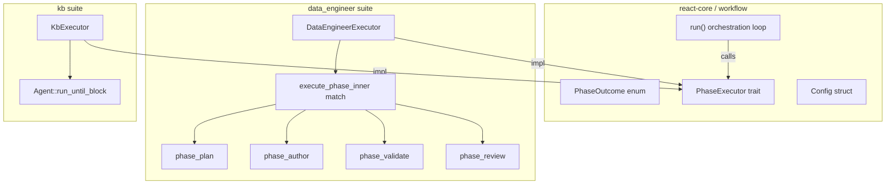

# Workflow Runner Core Extraction

## Design

The phase orchestration loop currently lives in `agent_modes.rs::run_agent` (~330 lines). The **outcome handling, budget management, and idle detection** are completely generic. The **state loading, guard evaluation, repair context, and phase dispatch** are data-engineer-specific.

The refactor extracts the generic loop into `core::workflow` and has both suites implement a thin `PhaseExecutor` trait.




## Core Changes

### New: `src/core/src/workflow/outcome.rs`

Move `PhaseExecutorOutcome` from [src/suites/data_engineer/src/lib.rs](src/suites/data_engineer/src/lib.rs) and rename to `PhaseOutcome`:

```rust
pub enum PhaseOutcome {
    StayedWithProgress { detail: String },
    StayedWaiting { reason: String },
    TransitionCommitted,
    Return(Vec<FlowFrame>),
    Failed { reason: String },
}

impl PhaseOutcome {
    pub fn stayed_with_progress(detail: impl Into<String>) -> Self { ... }
    pub fn stayed_waiting(reason: impl Into<String>) -> Self { ... }
}
```

### New: `src/core/src/workflow/runner.rs`

Three items: `Config`, `PhaseExecutor` trait, and `run()`.

```rust
pub struct Config {
    pub max_phase_steps: usize,
    pub max_consecutive_waiting_idle: usize,
    pub max_consecutive_waiting_active: usize,
}

#[async_trait]
pub trait PhaseExecutor: Send + Sync {
    /// Execute one turn of the workflow. The executor is responsible for
    /// loading state, evaluating guards, and dispatching to the correct
    /// phase. Append intermediate frames to `out_frames`.
    async fn execute_turn(&self, out_frames: &mut Vec<FlowFrame>) -> PhaseOutcome;

    /// Called when the step budget is exhausted. Mark state as failed.
    async fn on_budget_exhausted(&self, out_frames: &mut Vec<FlowFrame>, total_steps: usize);

    /// Current step count in the thread log (for idle detection).
    async fn step_count(&self) -> usize;
}
```

The `run()` function is the generic orchestration loop extracted from `run_agent` (lines 487-797 of `agent_modes.rs`). It handles:

- Budget management (`remaining_steps`, `total_steps`)
- Phase-change budget reset (via `StayedWithProgress`)
- Idle detection (`consecutive_waiting` with active/idle thresholds)
- Outcome dispatch (the `match` on `PhaseOutcome`)
- Budget exhaustion (calls `on_budget_exhausted`)

Approximately 40 lines of logic. The `run()` function signature:

```rust
pub async fn run(
    executor: &(dyn PhaseExecutor + '_),
    config: &Config,
) -> Result<Vec<FlowFrame>, String>
```

### Update: [src/core/src/workflow/mod.rs](src/core/src/workflow/mod.rs)

Add `pub mod outcome;` and `pub mod runner;`. Re-export key types.

### Update: [src/core/src/lib.rs](src/core/src/lib.rs)

No changes needed — `workflow` module already declared.

## Data Engineer Suite Changes

### Update: [src/suites/data_engineer/src/lib.rs](src/suites/data_engineer/src/lib.rs)

- **Delete** `PhaseExecutorOutcome` enum and its `impl` block (lines 168-216)
- **Add** `pub(crate) use react_core::workflow::{PhaseOutcome, Config as WorkflowConfig};`
- All internal references to `PhaseExecutorOutcome` become `PhaseOutcome`

### Update: [src/suites/data_engineer/src/agent_modes.rs](src/suites/data_engineer/src/agent_modes.rs)

**Major refactor of `run_agent` (lines 436-798):**

1. **Extract** a new `DataEngineerExecutor` struct that holds `ThreadStore`, `&SuiteCtx`, `thread_id`, `question`, and `max_replan_backtracks`:

```rust
struct DataEngineerExecutor<'a> {
    thread_store: ThreadStore,
    sctx: &'a SuiteCtx,
    thread_id: &'a str,
    question: &'a str,
    max_replan_backtracks: usize,
}
```

1. **Implement** `PhaseExecutor for DataEngineerExecutor`:
  - `execute_turn`: contains the body of the current `while` loop (lines 494-767) — load ExecutionState, evaluate pre-turn, build repair context, call `execute_phase`, return PhaseOutcome
  - `on_budget_exhausted`: contains lines 770-797 (load state, build budget message, mark_failed)
  - `step_count`: `thread_store.get(thread_id).steps.len()`
2. **Simplify** `run_agent` to:
  - Pre-loop setup (catalog bootstrap, resolve model name, build config)
  - Construct `DataEngineerExecutor`
  - Call `react_core::workflow::run(&executor, &config)`

### Rename across all phase files

Every file that references `PhaseExecutorOutcome` switches to `PhaseOutcome`:

- [src/suites/data_engineer/src/phase_plan.rs](src/suites/data_engineer/src/phase_plan.rs)
- [src/suites/data_engineer/src/phase_author.rs](src/suites/data_engineer/src/phase_author.rs)
- [src/suites/data_engineer/src/phase_validate.rs](src/suites/data_engineer/src/phase_validate.rs)
- [src/suites/data_engineer/src/phase_review.rs](src/suites/data_engineer/src/phase_review.rs)
- [src/suites/data_engineer/src/phase_publish.rs](src/suites/data_engineer/src/phase_publish.rs)
- [src/suites/data_engineer/src/retry_budget.rs](src/suites/data_engineer/src/retry_budget.rs)
- [src/suites/data_engineer/src/phase_gate.rs](src/suites/data_engineer/src/phase_gate.rs)
- [src/suites/data_engineer/src/tests_mod.rs](src/suites/data_engineer/src/tests_mod.rs)

This is a mechanical find-and-replace: `PhaseExecutorOutcome` -> `PhaseOutcome`, update the import path.

### No changes to phase executors

`execute_phase`, `execute_phase_inner`, and all individual phase executors (`execute_plan_phase`, `execute_author_phase`, etc.) stay exactly as they are. They now return `Result<PhaseOutcome, PhaseError>` instead of `Result<PhaseExecutorOutcome, PhaseError>` — same shape, just the type name changes.

## KB Suite Changes

### Update: [src/suites/kb/src/lib.rs](src/suites/kb/src/lib.rs)

1. **Add** a `KbExecutor` struct:

```rust
struct KbExecutor<'a> {
    thread_store: ThreadStore,
    sctx: &'a SuiteCtx,
    thread_id: &'a str,
    question: &'a str,
}
```

1. **Implement** `PhaseExecutor for KbExecutor`:
  - `execute_turn`: contains the body of current `run_kb` — build tools, build AgentCtx, call `Agent::run_until_block`, convert `RunOutcome` to `PhaseOutcome::Return(frames)` or `PhaseOutcome::Failed`
  - `on_budget_exhausted`: no-op (single-pass; budget of 1 means it never triggers)
  - `step_count`: `thread_store.get(thread_id).steps.len()`
2. **Simplify** `run_kb` to:
  - Construct `KbExecutor`
  - Build `Config { max_phase_steps: 1, .. }` (single iteration)
  - Call `react_core::workflow::run(&executor, &config)`
3. The `handle_new`, `handle_open`, `handle_user` implementations stay the same — they still call `run_kb`.

## What Does NOT Change

- `Suite` trait in core — unchanged
- `WorkflowSuiteContract` / `WorkflowNodeContract` — unchanged
- `Agent` / `AgentCtx` / `run_until_block` / `run_until_block_non_interactive` — unchanged
- `ToolRegistry` / `Tool` — unchanged
- All phase executors (plan, author, validate, review, publish, repair) — unchanged except type rename
- `ExecutionState`, `ProgressController`, `RepairPromptContext` — unchanged
- `PhaseError` — stays in data_engineer (DE-specific error variants)
- `WorkflowSuiteContract` impl for DataEngineerSuite — unchanged
- `run_ask`, `run_review` — unchanged (single-pass, don't use the workflow runner)

## Test Changes

- **Core**: Add a test in `workflow/runner.rs` with a mock `PhaseExecutor` that exercises budget exhaustion, idle detection, and the outcome variants
- **Data Engineer**: Update test imports from `PhaseExecutorOutcome` to `PhaseOutcome`. No logic changes — the behavior is identical
- **KB**: No new tests needed (existing smoke tests cover the path)

## Migration Strategy

Hard cutover — no backward compatibility:

1. Add core types and runner (compiles independently)
2. Update DE: delete `PhaseExecutorOutcome`, rename to `PhaseOutcome`, extract `DataEngineerExecutor`, simplify `run_agent`
3. Update KB: add `KbExecutor`, simplify `run_kb`
4. `cargo check` and `cargo test` at each step

